  

  
  
  

---

I work on making deep learning models perform better **without spending more compute to get there** — through architectural refinements and data-level improvements.

Research Assistant at **NISC, Nile University** · M.Sc. student in **Artificial Intelligence** · Two papers under review.

 

## Selected work

<table>
<tr>
<td width="120" align="center"><h3>4→2</h3>GPUS REQUIRED</td>
<td>
<b><a href="https://github.com/Shrouk21/modified_stp3">ST-P3 — End-to-End Autonomous Driving</a></b> 
Refactored the official codebase — perception, prediction, and planning unified through spatial-temporal feature learning — and re-engineered training for distributed execution, bringing a 4×V100 setup down onto 2×T4 on Kaggle. Evaluated on nuScenes. 
<code>PyTorch</code> <code>Distributed training</code> <code>nuScenes</code> · <i>original method: Hu et al., ECCV 2022</i>
</td>
</tr>

<tr>
<td width="120" align="center"><h3>87%</h3>DICE · +10%</td>
<td>
<b>3D Segmentation for Cardiac MRI Cine Views</b> 
ResNet-style segmentation with a diffusion model applied at inference time to lift performance on small, under-represented classes. 87% Dice, 89% foreground — 10% over baseline. 
<code>PyTorch</code> <code>Medical imaging</code> <code>Diffusion</code> · <i>private — paper in preparation</i>
</td>
</tr>

<tr>
<td width="120" align="center"><h3>92.1%</h3>ALLOCATION RATE</td>
<td>
<b><a href="https://github.com/Shrouk21/Reinforcement-Learning-for-Cloud-VM-Allocation-Strategy">RL for Cloud VM Allocation</a></b> 
A PPO agent that selects an allocation <i>strategy</i> per request rather than a specific machine — collapsing an unwieldy action space into a tractable one. 100% high-priority success, beating every fixed heuristic under contention. 
<code>PPO</code> <code>Gymnasium</code> <code>SQL</code> <code>PSO</code>
</td>
</tr>

<tr>
<td width="120" align="center"><h3>+25%</h3>RELEVANCE</td>
<td>
<b><a href="https://github.com/Shrouk21/Assistant-chatbot">Agentic Code Assistant with RAG</a></b> 
A LangGraph agent that classifies each request and routes it to a specialized path — generation, explanation, or analysis — with ChromaDB retrieval supplying code context. The conditional workflow carried the gain, not the prompt. 
<code>LangGraph</code> <code>LangChain</code> <code>RAG</code> <code>ChromaDB</code>
</td>
</tr>

<tr>
<td width="120" align="center"><h3>96%</h3>ACCURACY</td>
<td>
<b><a href="https://github.com/Shrouk21/Arabic-Dialect-Sentiment-Analysis">Arabic Dialect Sentiment Analysis</a></b> 
AraBERT and MarBERT fine-tuned for multi-dialect classification, with preprocessing built specifically around a small, unevenly distributed dataset. 
<code>AraBERT</code> <code>MarBERT</code> <code>Low-resource NLP</code>
</td>
</tr>

<tr>
<td width="120" align="center"><h3>8</h3>CLASSES</td>
<td>
<b><a href="https://github.com/Shrouk21/UNet-ObjectDetection-Lyft">U-Net Semantic Segmentation</a></b> 
Encoder-decoder with skip connections for pixel-level classification on the Lyft self-driving dataset, wrapped in a full PyTorch Lightning pipeline with scheduling, checkpointing, and TensorBoard tracking. 
<code>U-Net</code> <code>PyTorch Lightning</code> <code>TensorBoard</code>
</td>
</tr>
</table>

 

## Publications

| Venue | Paper | Status |
|:--|:--|:--|
| **UBMK 2026** | Efficient Forecasting of Chaotic Attractors Using Machine Learning and Phase Space Reconstruction | Under review |
| **MIUCC 2026** | Few Words, Many Dialects: Benchmarking Transformers for Low-Resource Arabic Dialect Sentiment Analysis | Under review |

 

## Stack

 

## Also built

**Early Warning Water Pollution Detection** — anomaly detection over multi-sensor time series; +22% early detection rate over heuristic baselines.

**RL for Wireless QoS Optimization** — adaptive QoS framework; 18% better throughput-latency tradeoff.

**Audio Classification via Spectrograms** — audio recast as images, Librosa spectrograms into a FastAI ResNet vision learner.

 

---

Open to AI/ML engineering roles where model quality and compute cost both matter.
